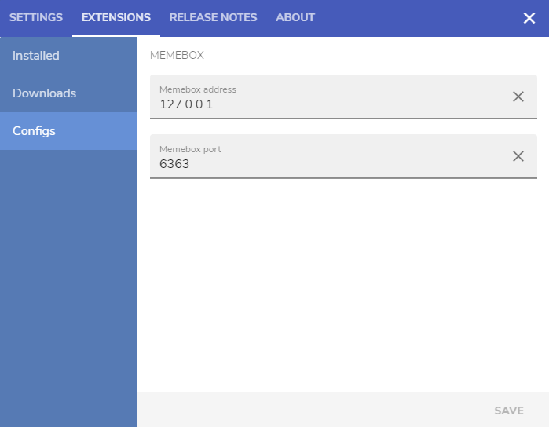

# Deckboard Memebox

[Deckboard](https://deckboard.app/) extension for adding [Memebox](https://github.com/negue/meme-box) triggers

# Setup

* Install [Deckboard](https://deckboard.app/) app
* Install [Memebox](https://github.com/negue/meme-box) (or a [Nightly build](https://github.com/negue/meme-box-nightly/releases))
* Clone the repository to your pc
* cd into your cloned repository folder
* Run `npm install` command
* Open deckboard app and under extensions configs fill in your memebox connection information

# Author

* [Igor Ilić](https://bio.link/igorilic)

